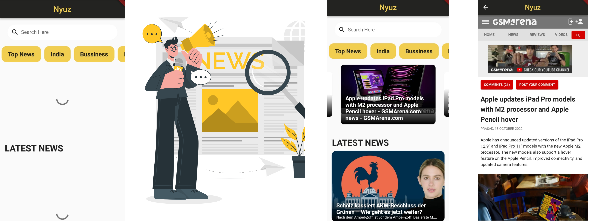

# Nyuz
The purpose of the project is to develop an application which will display news articles approved at backend. User can browse news articles through various categories. App will enable user to view news details.
  

 

### Flutter News App
Flutter News App with newsapi.org. Developed using the Test Driven Development.

### News App Features
  1) List daily news.
  2) Filter daily news by category.
  3) Search news
  4) Go to detail news website.

### Created By:-
1) [Dhruvi Sherathiya (CE126)](https://github.com/DhruviSherathiya)
2) [Aneri Sonani (CE136)](https://github.com/AneriSonani09)
